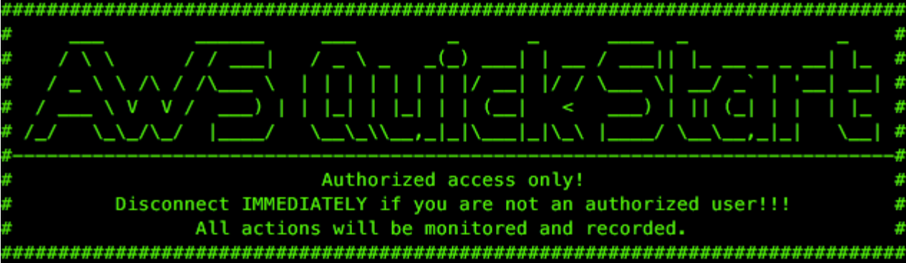
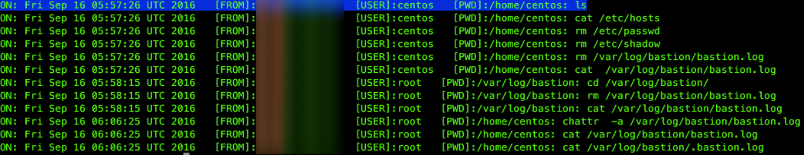

// Add steps as necessary for accessing the software, post-configuration, and testing. Don’t include full usage instructions for your software, but add links to your product documentation for that information.
//Should any sections not be applicable, remove them

== Post-deployment steps
// If post-deployment steps are required, add them here. If not, remove the heading
Log in to the bastion host. Use one of the following user names, depending on your
choice of Linux distribution:

* Amazon Linux: *ec2-user*
* CentOS: *centos*
* Ubuntu: *ubuntu*

The Linux distribution is specified in the *Bastion AMI operating system* parameter when you deploy the templates. For more information, see link:#_parameter_reference[Parameter reference].

=== Enabling and customizing the Linux bastion host banner
:xrefstyle: short
This Quick Start provides the default banner illustrated in <<banner>> for the Linux bastion
hosts. The banner is disabled by default. To enable it, set the
*Bastion banner* parameter to *true* during deployment.

[#banner]
.Customizing the Linux bastion host banner

To customize the banner, create an ASCII text file with your own banner content. Then upload it to an S3 bucket or other publicly accessible location, and verify that it is accessible from the host. 

=== Bastion logging
The bastion hosts deployed by this Quick Start provide a command logger in the
`/var/log/audit/audit.log` file. This log file contains the
date, SSH client connection IP address, user name, working directory, and the
commands issued.

For added security, the contents of the `/var/log/audit/audit.log` file is also stored
in a CloudWatch Logs log group in the AWS Cloud, and remains available in case the
bastion hosts fail.

The log includes a history of the commands that are run when you log in. <<logging>> shows an example.

:xrefstyle: short
[#logging]
.Bastion logging

To notify your users that all their commands will be monitored and logged, we recommend that you enable the bastion host banner. For more information, see link:#_enabling_and_customizing_the_linux_bastion_host_banner[Enabling and Customizing the Linux bastion host banner]. The default banner text includes the alert shown in <<banner>>, which you can customize.

The `bastion.log` file is an immutable file that cannot be easily deleted or tampered with. However, in case this happens, there is a shadow file with a copy of `bastion.log` located in `/var/log/audit/audit.log`. And, the Quick Start also stores the contents of `bastion.log` remotely using the CloudWatch Logs service. Log files can be found under CloudWatch Logs using the instance ID as the log stream name.

== Best practices for using {partner-product-short-name} on AWS
// Provide post-deployment best practices for using the technology on AWS, including considerations such as migrating data, backups, ensuring high performance, high availability, etc. Link to software documentation for detailed information.
The architecture built by this Quick Start supports AWS best practices for high availability and security.

* Linux bastion hosts are deployed in two Availability Zones to support immediate access across the VPC. You can configure the number of bastion host instances at launch.
* An Auto Scaling group ensures that the number of bastion host instances always matches the desired capacity you specify during launch.
* Bastion hosts are deployed in the public (DMZ) subnets of the VPC.
* Elastic IP addresses are associated with bastion instances to allow these IP addresses from on-premises firewalls. When an instance is shut down, the Auto Scaling group launches a new instance, and the existing Elastic IP addresses are associated with it. This ensures that the same trusted Elastic IP addresses are used at all times.
* Inbound access to bastion hosts is locked down to known CIDR scopes. This is achieved by associating the bastion instances with a security group. The Quick Start creates a BastionSecurityGroup resource for this purpose.
* Ports are limited to allow only the necessary access to the bastion hosts. For Linux bastion hosts, TCP port 22 for SSH connections is typically the only port allowed.

We recommend that you follow these best practices when using the architecture built by the Quick Start:

* When you add new instances to the VPC that require management access from the bastion host, associate a security group inbound rule with each instance. The rule should reference the bastion security group as the source. It is also important to limit access to the required ports for administration.
* During deployment, the public key from the Amazon EC2 key pair is associated with the user ec2-user in the Linux instance. For additional users, create users with the required permissions and associate them with their individual authorized public keys for SSH connectivity.
* For the bastion host instances, select the number and type of instances according to the number of users and operations to be performed. The Quick Start creates one bastion host instance and uses the t2.micro instance type by default, but you can change these settings during deployment.

NOTE: You can also change the number and type of bastion host instances after deployment by updating the AWS CloudFormation stack and changing the parameters. Reconfiguring the bastion host instances updates the related Elastic IP addresses and changes the bootstrapping logic in the launch configuration and Auto Scaling group. However, before you update the stack, you must shut down the instances you want to replace while keeping the Elastic IP addresses. When you update the stack, the Auto Scaling group launches the new instances with the updated instance type. Bootstrapping will assign the Elastic IP addresses from the existing pool of IP addresses that were provisioned during the initial deployment. 

* Set your desired expiration time directly in the CloudWatch Logs log group for the logs collected from each bastion instance. This ensures that bastion log history is retained only for the amount of time you need.
* Keep CloudWatch log files for each bastion host instance separate so that you can filter and isolate log messages from individual bastion hosts. Every instance that is launched by the bastion Auto Scaling group will create its own log stream based on the instance ID.

== Security
// Provide post-deployment best practices for using the technology on AWS, including considerations such as migrating data, backups, ensuring high performance, high availability, etc. Link to software documentation for detailed information.
This Quick Start provisions one Linux bastion host in each Availability Zone with a single
security group as a virtual firewall. This security group is required for remote access from
the Internet. The security group is configured as follows:

=== Inbound
|===
|Source|Protocol|Ports

|Remote access CIDR|TCP|22
|Remote access CIDR|ICMP|N/A
|===

=== Outbound
|===
|Destination|Protocol|Ports

|0.0.0.0/0 |All|All
|===

For more information, see https://docs.aws.amazon.com/AmazonVPC/latest/UserGuide/VPC_Security.html[Internetwork traffic privacy in Amazon VPC^].

== Other useful information
//Provide any other information of interest to users, especially focusing on areas where AWS or cloud usage differs from on-premises usage.

* https://aws.amazon.com/documentation/cloudformation/[AWS CloudFormation Documentation^]

* Amazon EC2
** https://docs.aws.amazon.com/AWSEC2/latest/UserGuide/[What is Amazon EC2?^]

** https://docs.aws.amazon.com/AWSEC2/latest/UserGuide/elastic-ip-addresses-eip.html[Elastic IP addresses^]

* https://aws.amazon.com/documentation/vpc/[Amazon Virtual Private Cloud Documentation^]

** https://docs.aws.amazon.com/AmazonVPC/latest/UserGuide/VPC_SecurityGroups.html[Security groups for your VPC^]

** https://blogs.aws.amazon.com/security/post/Tx3N8GFK85UN1G6/Securely-connect-to-Linux-instances-running-in-a-private-Amazon-VPC[Securely Connect to Linux Instances Running a Private Amazon VPC^]