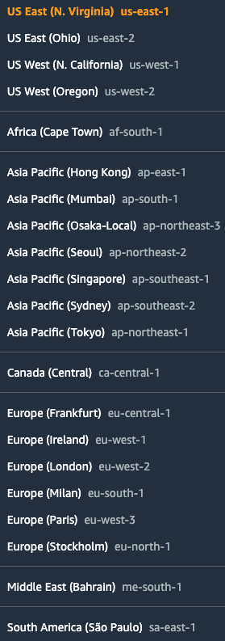
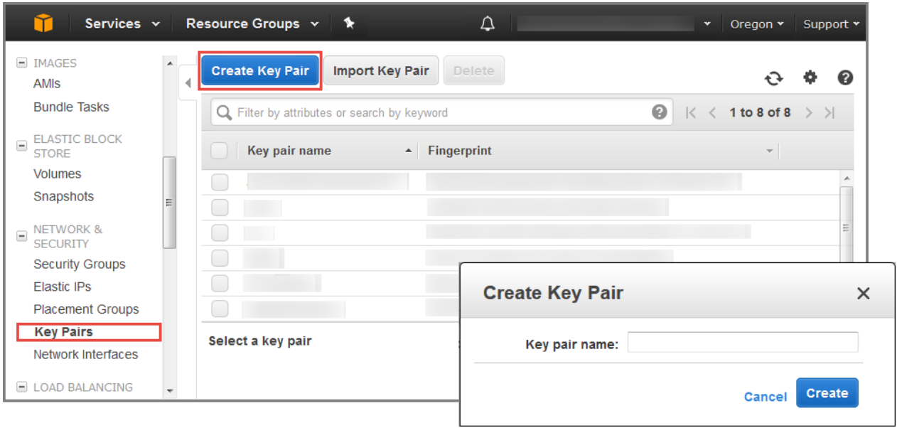

// If no preperation is required, remove all content from here

=== Prepare your AWS account

==== Choose a Region

* Before deploying the stack, in the AWS Management Console, choose an AWS Region from the top toolbar.
+
:xrefstyle: short
[#region]
.Selecting an AWS Region

+
NOTE: Consider choosing a Region closest to your data center or corporate network to
reduce network latency between systems running on AWS and the systems and users
on your corporate network.

==== Create a key pair

To create a http://docs.aws.amazon.com/AWSEC2/latest/UserGuide/ec2-key-pairs.html[key pair] in your preferred Region, do the following:

[start=1]
. In your AWS Management Console, choose an AWS Region.
. On the *Services* menu, choose *EC2*.
. Under *Network and Security*, choose *Key Pairs*.
. Choose *Create Key Pair*.
. Enter a name and choose *Create*.
+
:xrefstyle: short
[#keypair]
.Creating a key pair

+
Amazon EC2 uses public-key cryptography to encrypt and decrypt login information. To
be able to log in to your instances, you must create a key pair. On Linux, the key pair is
used to authenticate SSH login.

